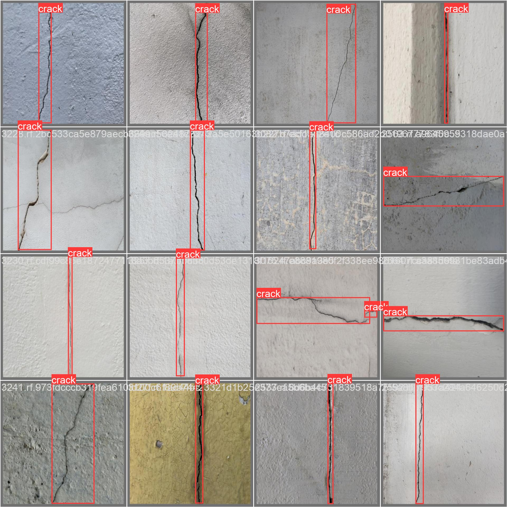

# Crack Watcher

This project contains code for crack detection using the YOLO object detection algorithm. It includes two main scripts: `run.py` and `train.py`, along with a `main.py` script to provide command-line functionality.

## Getting Started

To get started with the project, follow the instructions below.

### Prerequisites

Make sure you have the following dependencies installed:

-   Python (version 3.8 or higher)
-   OpenCV
-   Ultralytics
-   Roboflow

You can use the [requirements.txt](requirements.txt) file to install the required dependencies. See the [Installation](#installation) section for more details.

### Installation

1. Clone the repository:

```bash
git clone git@github.com:ViniciosLugli/crack-watcher-yolo.git
cd crack-watcher-yolo
```

2. Install the required dependencies:

```bash
pip install -r requirements.txt
```

3. Set up the Roboflow API key:

If you plan to use the `train.py` script with Roboflow, make sure you have a valid Roboflow API key. Set the `ROBOFLOW_API_KEY` environment variable with your API key.

```bash
export ROBOFLOW_API_KEY=<your-api-key>
```

### Usage

The project provides command-line functionality through the `main.py` script. Below are the available commands:

-   `help`: Prints the help message for the project.

```bash
python main.py help
```

-   `run`: Runs the crack detection model on an image.

```bash
python main.py run <image-path>
```

-   `train`: Trains the crack detection model.

```bash
python main.py train
```

## Scripts

### `run.py`

This script contains a `CrackModelRunner` class that loads a pre-trained YOLO model and provides methods for detecting and drawing bounding boxes around cracks in an image.

-   `find(image_path)`: Takes an image path as input and returns the crack detection results as a list of bounding boxes.
-   `draw(image_path, results)`: Takes an image path and the crack detection results and draws bounding boxes and labels around the cracks. Returns the modified image.

### `train.py`

This script contains a `RoboflowTrainer` class that handles training the crack detection model using the YOLO algorithm. It utilizes the Roboflow API to download the dataset and trains the model using the Ultralytics YOLO implementation.

-   `download_dataset(version)`: Downloads the dataset associated with the specified version from Roboflow. Returns the downloaded dataset.
-   `train_model(epochs, batch_size)`: Trains the YOLO model with the specified number of epochs and batch size using the downloaded dataset.

### `main.py`

This script provides command-line functionality for the project. It defines a `Commands` class with methods corresponding to each command, such as `help()`, `run(image_path)`, and `train()`. The `COMMANDS` dictionary maps each command name to its corresponding method. The `main()` function parses the command-line arguments and executes the appropriate command.

## Train test output:


